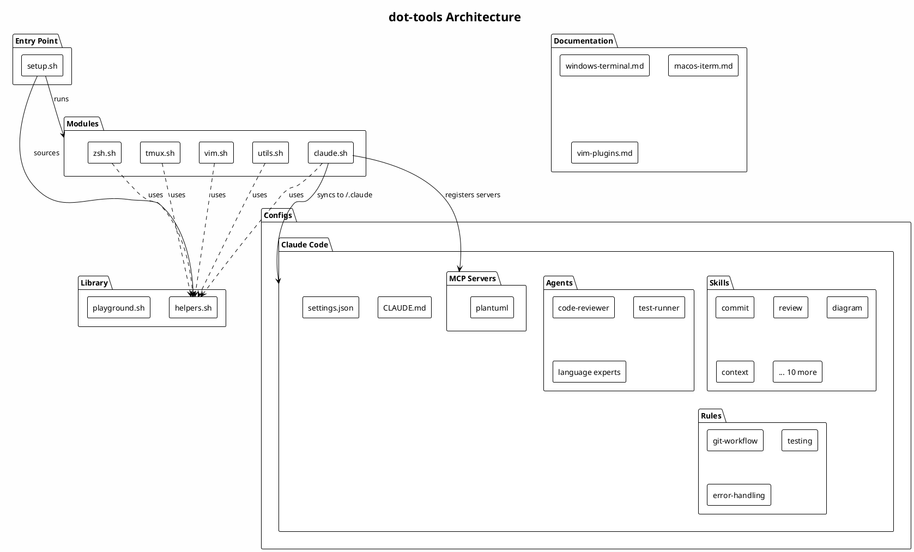

# dot-tools

Personal dotfiles and configuration tools.

## Architecture

[](https://www.plantuml.com/plantuml/uml/~1UDfrLCbksp0GlUihMFSijRtcKCHmqbC210rwAeo05YSoQou2EVJI8lts3abJeWi71WpolLdUZ6Puwv4x35er7t0B6jYek3IDtqapSiSrs_1-DpWRZ5XPPHtx-Eq-_YgBtkhH6Z3uZ2S5p46Ft0mAcWOb4Y0ijcYjycpf-gr4ueCZTgJ8V02sk3VeJkp9IeCBzgTXxAS736Fdjsl6FKkNvgroU90Rnzrf4LabDzbd2se4vulN-HePAkcKIoZaZ5p4VRGYAF0fhixd7FkttnPNEaO4TJWMA9uZjfUwG7ICI42f9aNf4j5UyI2WmFbseMDbpQiSieu-dvEEsI3vi9KLi9XZHDDaHpbM3yiVT_UT5bKEBJ973KLf1j_zyjQK5YSayUblIlMyaqfbAJuTpnbY7LPhYUk9Uib0eHti9HmgEWE55f8FD3uLVqRcy0RXU1a_8SMWwphsvJDzAGULKRmcYxShrIm7cjDS3K_7kXe1RPO8RZrP_ASQmMFhWZ4NDX4j5eg6FyHaSAG1H5-PHUfTQT-dqNFJuAM0WyJsODtkLTdSpSY_37EZOtRwUZDNom7dh6ktt0XrOPFmTyKyhfxOCxWzRL3UXdwS1T7scFXahC_CIm6cS6yNutnd-w2fVexIcXHEsFwyMGTfX3tu5i5fQRYA4njnpNlhMndX0j5EjQCAWpG-GPGYFGsiRR-MTMStpDlWUl0LLrRvXYetlcbeXLdNrJx1aqDSusiuvRq6ftM-HkHbkyOKAeggLfOqdmmr12tx-waxlmULQMm-QOT1UepHVFumJNCBHb3R_m7V-k5F)

<details>
<summary>PlantUML source</summary>



</details>

## Documentation

### Terminal Setup
- [Windows Terminal](docs/windows-terminal.md) - Complete Windows Terminal configuration guide
- [macOS iTerm2](docs/macos-iterm.md) - Complete iTerm2 configuration guide for macOS

### Vim
- [Vim Plugins & Extensions Reference](docs/vim-plugins.md) - Curated list of 100 Vim plugins organized by category

## Configurations

### Claude Code (`configs/claude/`)

User-level Claude Code configuration. Symlink to `~/.claude/`:

```bash
ln -s /path/to/dot-tools/configs/claude ~/.claude
```

**Contents:**

| Path | Description |
|------|-------------|
| `CLAUDE.md` | User preferences and coding style |
| `settings.json` | Permissions and tool allowlists |
| `skills/commit/` | Guided git commit workflow |
| `skills/review/` | Code review checklist |
| `skills/explain/` | Code explanation helper |
| `skills/refactor/` | Refactoring guide |
| `skills/diagram/` | Create PlantUML diagrams for documentation |
| `skills/mdview/` | Render and view markdown in browser |
| `agents/code-reviewer.md` | Specialized code review agent |
| `agents/test-runner.md` | Test execution and debugging agent |
| `rules/git-workflow.md` | Git conventions |
| `rules/error-handling.md` | Error handling best practices |
| `rules/testing.md` | Testing conventions |

## Setup

```bash
./setup.sh
```
