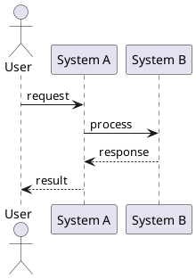
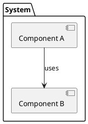
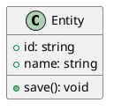

Create a PlantUML diagram and optionally add it to a markdown file.

## Usage

- `/diagram sequence user login flow` - Create a sequence diagram
- `/diagram component for README.md` - Create a component diagram and add to README
- `/diagram class data models` - Create a class diagram

## Steps

1. **Determine diagram type** from arguments:
   - `sequence` - Interactions between actors/systems
   - `component` - System architecture and dependencies
   - `class` - Data models and relationships
   - `activity` - Workflows and decision flows
   - `state` - State machines

2. **Create the PlantUML syntax** appropriate for the type

3. **Generate URLs** using the plantuml plugin MCP server:
   ```bash
   cd /path/to/plugins/plantuml && printf '%s\n%s\n%s\n' \
     '{"jsonrpc":"2.0","id":0,"method":"initialize","params":{"protocolVersion":"2024-11-05","capabilities":{},"clientInfo":{"name":"claude","version":"1.0"}}}' \
     '{"jsonrpc":"2.0","method":"notifications/initialized"}' \
     '{"jsonrpc":"2.0","id":1,"method":"tools/call","params":{"name":"plantuml_generate_urls","arguments":{"diagram":"..."}}}' \
     | python3 main.py
   ```

4. **If a target file is specified**, add the diagram to it:
   - Insert image as a clickable link to the editor: `[](editor-url)`
   - The PNG renders inline in documentation; clicking it opens the PlantUML editor
   - Add collapsible source in a `<details>` block

5. **Show the user**:
   - The generated URLs (png, svg, editor)
   - The PlantUML source code

## Diagram Templates

### Sequence


### Component


### Class


## Output Format

When adding to a file, wrap the image in a link to the editor so it renders inline and opens the editor on click:
```markdown
[](https://www.plantuml.com/plantuml/uml/~1...)

<details>
<summary>PlantUML source</summary>

\`\`\`plantuml
@startuml
...
@enduml
\`\`\`

</details>
```
